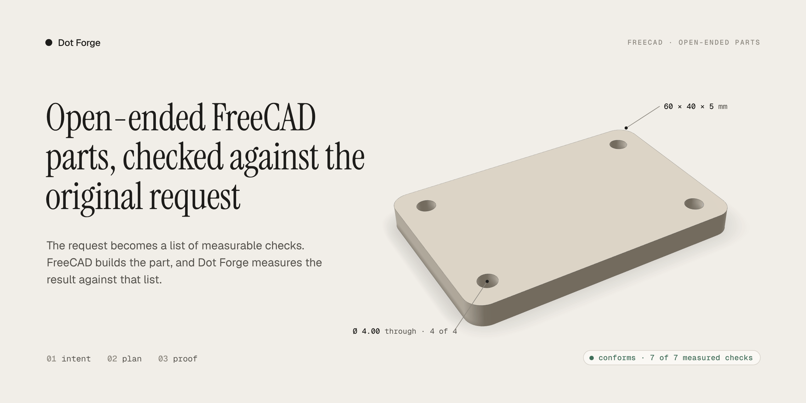
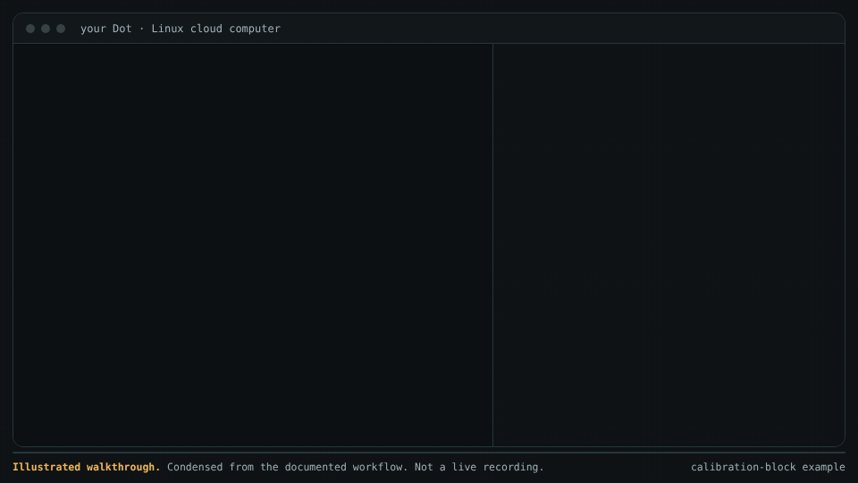
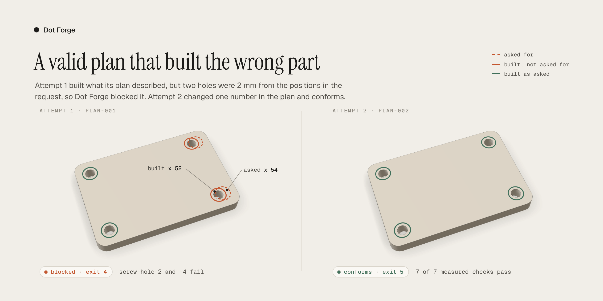
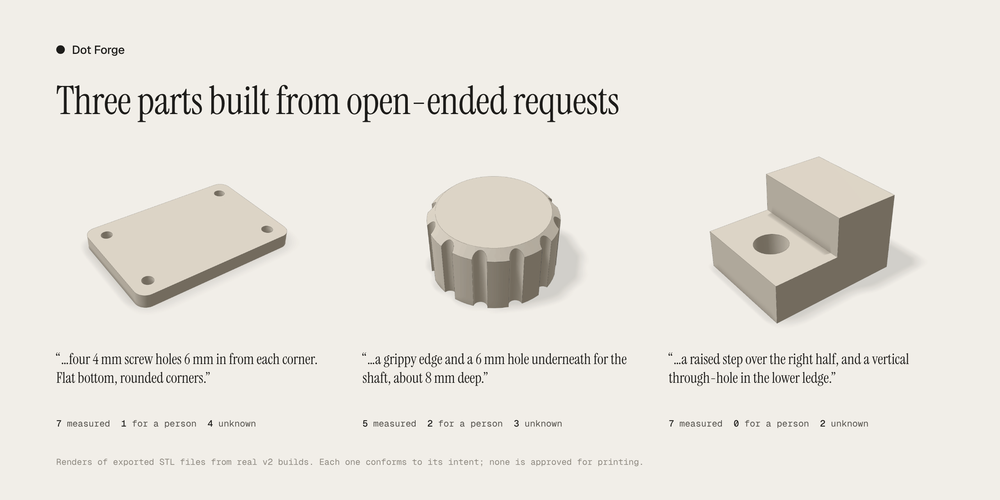
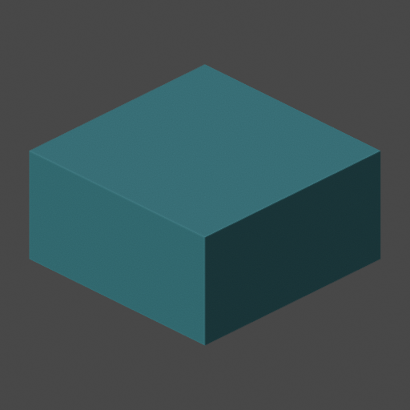
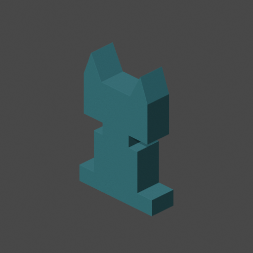
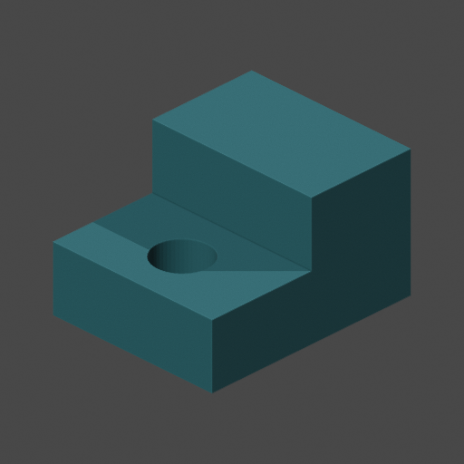

# Dot Forge



**Make a small 3D model with your Dot. Keep the model, the source, and the check results together.**

Dot Forge gives your Dot instructions, three reviewed model generators, and a v2 preview for open-ended FreeCAD parts. Your Dot runs the tools on its Linux cloud computer. You do not need to operate Blender or FreeCAD yourself.

- **Reviewed generators:** a calibration block, a flat robot mascot, or a stepped solid with a through-hole, made from dimensions that you supply.
- **v2 preview:** a part described in your own words. The request becomes measurable checks, FreeCAD builds a plan, and Dot Forge measures the result against the request. See [v2 preview](#v2-preview-open-ended-parts-in-freecad).

Each result is a **3D-printing candidate**: a model that still needs printing and physical checks. A successful geometry check does not mean that the part is ready to print or safe to use. This repository contains source and instructions. It does not install applications.

[Start with your Dot](#start-with-your-dot) · [See the examples](#supported-models) · [Run the commands](#run-from-a-source-checkout) · [Understand the checks](#what-the-checks-establish)

## See it in action



This is a real v2 session, replayed. The commands, output, exit codes and times come from a recording in a Debian 13 container with FreeCAD 1.0.0 ([session data](docs/media/src/session.js)). Output is trimmed with `jq`, and the replay shortens the build waits. See the [MP4 version](docs/media/demo.mp4).





The model images are renders of exported STL files from real v2 builds of the [v2 examples](examples/v2). The hole rings, labels and counts come from each build's measurements. The sources are in [docs/media/src](docs/media/src). To regenerate the images, build the examples, copy each `exports/model.stl` and `native/measure.json` into one folder as `<run>.stl` and `<run>.measure.json`, then run `node docs/media/render-models.mjs <folder>` and `node docs/media/render-media.mjs`. These need Node, Playwright, three.js 0.170.0, ffmpeg, and network access to Google Fonts.

## Supported models

The default profile is `dot-native`. It supports these three model families. Each request produces one solid part. Width, depth, and height must each be 5–100 millimeters (mm).

| Calibration block | Flat robot mascot | Stepped part with a through-hole |
| --- | --- | --- |
|  |  |  |
| Example: 20 × 20 × 10 mm | Example: 40 × 12 × 60 mm | Example: 30 × 24 × 18 mm |
| [Example request](examples/calibration-part/request.json) | [Example request](examples/geometric-mascot/request.json) | [Example request](examples/freecad-stepped-part/request.json) |

**These images are renders of the exported STL files. They are not photographs of physical prints.** Dimensions above are width × depth × height. The [image notes](docs/images/README.md) identify the source and license.

- **`calibration-block`** uses Blender. It makes a rectangular block from width, depth, and height. Use it to try the model and evidence workflow.
- **`geometric-mascot`** uses Blender. It makes the supplied flat robot outline with a constant depth. The supported dimensions change its size; they do not define a new character.
- **`freecad-stepped-block`** uses FreeCAD. It makes an integral half-height base, a raised half-width step, and a vertical through-hole. The generator sets the step and hole proportions. See the [FreeCAD workflow](docs/freecad-workflow.md).

Choose Blender for the block or flat mascot. Choose FreeCAD for the supported stepped solid. A different part, assembly, or organic character needs a separately reviewed generator, or the v2 preview below. Keep changes within the [request contract](schemas/model-request.v1.json) and the selected generator's supported parameters.

## v2 preview: open-ended parts in FreeCAD

v2 is for a part that none of the three families can make. You do not choose a generator. Instead:

1. **Intent.** The assistant writes the ask as measurable checks in `intent.json`: envelope, holes, flat faces and volume. Requirements that it cannot measure become notes for a person. Values that the ask does not state stay unknown. The user confirms the intent before any geometry is made.
2. **Plan.** The assistant writes a FreeCAD feature tree in `plan.json`: primitives, extrusions, booleans, patterns and fillets. The plan is data, not code, and it is bound to the confirmed intent by hash.
3. **Proof.** `printkit build` interprets the plan in FreeCAD, measures the solid, and checks each intent item. It also runs the independent STL checks. The report keeps "is it the part that was asked for?", "is the mesh sound?" and "is it ready to print?" separate.

```sh
python -m printkit check-intent examples/v2/mounting-plate/intent.json
python -m printkit check-plan examples/v2/mounting-plate/plan.json --intent examples/v2/mounting-plate/intent.json
python -m printkit build --intent examples/v2/mounting-plate/intent.json --plan examples/v2/mounting-plate/plan.json --output build/plate-001
```

**This is a preview.** The native tests passed on a Dot's exact FreeCAD 1.0.0 / OCC 7.8.1 profile at commit `f9aba35`. Later changes pass the same tests in a matching container. v2 does not make previews or bundles yet. See [v2: intent, plan, proof](docs/v2-intent-and-plan.md).

## Start with your Dot

Give your Dot this repository URL: <https://github.com/joseph-robert-f/dot-forge>. Then copy this instruction:

> Use Dot Forge on your Linux cloud computer. Read README.md and AGENTS.md. Check the installed applications. Run the capability doctor and all three bundled smoke examples. Do not download or install software without permission. Help me choose a supported model family. Ask for missing dimensions and intended-use details that affect the result. Keep unknown printer and material information unknown. Make a new candidate in a new run directory. Check the native model and the exported STL separately. Review the front, side, back, top, and oblique views of the exported STL. Show me the findings and the checks that remain. Give me the editable model, STL, previews, and evidence in a durable bundle. Verify the bundle after retrieval. Follow your normal permission rules for setup, sharing, and printer access. Do not call the model print-ready without evidence.

Add one request, for example:

- “Make the supplied flat robot mascot, 40 mm wide, 12 mm deep, and 60 mm high.”
- “Make the supplied stepped part, 30 mm wide, 24 mm deep, and 18 mm high. Ask what I intend to use it for.”

Your Dot must explain when a request is outside the supported scope. It must not substitute an unsupported generator. See the [assistant workflow](docs/assistant-workflow.md) for the full procedure.

## Prerequisites

The documented native profile uses:

- Linux x86_64 on the Dot cloud computer
- Python 3.11 or later for the command-line workflow
- Blender 4.3.2 for the two mesh generators and all STL preview renders
- FreeCAD 1.0.0 with Open CASCADE 7.8.1 for the stepped solid
- A full, reviewed source checkout with its schemas, examples, and runtime locks

The Python workflow has no pip runtime dependencies. Blender and FreeCAD are separate installed applications. The observed orchestration Python is 3.12.14; the observed system Python for FreeCAD is 3.13.5. Check the actual computer before use. A version string or another computer's result is not acceptance evidence.

Follow [runtime setup](docs/runtime-setup.md) if an application is missing or cannot run. Do not silently install software, change the required versions, or weaken a runtime check. A standalone wheel is not a supported distribution.

## Run from a source checkout

These commands are for your Dot or a contributor. Run them from the repository root. Use a new output directory for each attempt.

### 1. Check the source and the computer

```sh
export PYTHONPATH="$PWD/src"
python --version
python -m printkit --help
python -m unittest discover -s tests -v
python -m printkit doctor --json
python -m printkit doctor --json --all-smoke build/dot-native-smoke-001
```

Read the test summary, including skipped tests. The `--all-smoke` command runs all three native families. It checks native reopening, exported-STL geometry, and five-view rendering. All three must pass their required checks for default-profile acceptance. Application discovery alone is not sufficient. Manual and printing checks remain separate.

### 2. Make and inspect a candidate

```sh
python -m printkit check-request examples/calibration-part/request.json
python -m printkit run --request examples/calibration-part/request.json --output build/calibration-001
python -m printkit inspect --run build/calibration-001
```

**Exit code 5 means that manual or printing review is required.** A geometry-valid candidate normally has this code. Read the JSON report before continuing. A failed, unavailable, skipped, or inconclusive check is not a pass. See [all exit codes](docs/cli.md#exit-codes).

Open `build/calibration-001/previews/contact-sheet.html`. Compare all five views with the request. Check dimensions and required features. A render does not establish user visual approval.

For the mascot, use `examples/geometric-mascot/request.json` and a new output directory. For the stepped part, follow the [FreeCAD workflow](docs/freecad-workflow.md). If you change dimensions, update both the supported parameters and the requested dimensions. Run `check-request` again.

### 3. Preserve and verify the evidence

```sh
python -m printkit bundle --run build/calibration-001 --output build/calibration-001.zip
python -m printkit verify-bundle build/calibration-001.zip
```

The `run` command finalizes an evidence directory. It does not create the ZIP. Put the ZIP outside the run directory and use a new filename. Copy it to an authorized durable destination, retrieve it, and run `verify-bundle` on that retrieved copy. A temporary local path is not delivery.

Inspect the bundle for private information before sharing it. A valid bundle can contain a blocked model. Bundle integrity does not establish print suitability.

## What you receive

A completed run retains the request, source snapshot, and evidence with the model:

| Output | Purpose |
| --- | --- |
| `native/model.blend` or `native/model.FCStd` | Editable native model for the selected backend |
| `exports/model.stl` | Exported mesh candidate that the independent geometry checks inspect |
| `exports/model.step` | Solid exchange file for the FreeCAD family only |
| `previews/` | Front, side, back, top, and oblique STL renders, plus a labeled contact sheet |
| `validation.json` and `metrics.json` | Geometry findings, measurements, and unresolved checks |
| `request.json`, `source/`, and `logs/` | Inputs, source used for the attempt, and execution records |
| `manifest.json` and `journal.json` | Artifact hashes and stage records for integrity and recovery |

The separate ZIP bundle preserves the finalized evidence set. Keep failed attempts. Make repairs in a new attempt and repeat downstream checks. See [recovery and bundles](docs/recovery.md).

## What the checks establish

Dot Forge separates model geometry from printing decisions:

1. **Native checks** test whether the model can be reopened. The FreeCAD route also checks the native solid and the STEP round trip.
2. **Independent STL checks** examine the exported mesh. They cover topology, dimensions, volume, intersections, and the supported single-solid profile. FreeCAD checks also test the expected step and hole features.
3. **Preview review** compares five views of the actual STL with the requested shape. Images alone cannot establish dimensions, strength, or print suitability.
4. **Printing and physical checks remain open.** These include printer and material settings, wall thickness, clearances, orientation, supports, slicing, user visual approval, and a physical test.

A native solid can pass while its exported mesh fails. A mesh can pass geometry checks while its physical use remains unknown. The reports must keep these results separate. See [validation explained](docs/validation-explained.md), [release verification](docs/release-validation.md), and [FreeCAD verification](docs/freecad-verification.md).

### Release limits

This regular release is **ready for the three supported Linux workflows**. It does not certify every parameter combination, printer, material, or physical use. Each Dot must run fresh smoke acceptance on its own computer.

The optional Lane A adapter requires Blender 4.5.12 LTS. Its exact-runtime acceptance remains blocked because official retrieval returned HTTP 403. Lane A is not required for the default `dot-native` profile. The original architecture MVP remains incomplete because its Lane A requirement is unchanged. See the [acceptance map](docs/acceptance.md).

Optional tools found by the doctor, including experimental 3D Slicer files, are inventory only. Their presence does not establish a supported generator or toolpath workflow.

## More instructions

- [Quickstart](docs/quickstart.md): the complete command sequence
- [CLI reference](docs/cli.md): commands, flags, and exit codes
- [Compatibility](docs/compatibility.md): runtime boundaries
- [Benchmark methodology](benchmarks/methodology.md): how results are measured
- [Releases](https://github.com/joseph-robert-f/dot-forge/releases): source releases and release notes
- [Contributing](CONTRIBUTING.md): checks and requirements for changes

## Security, sharing, and license

Model commands do not download applications or send models to a printer. Native subprocess limits are not a security sandbox. Run only reviewed code. Read [SECURITY.md](SECURITY.md) before use.

Keep generated models, private requests, and benchmark runs outside Git. The three public example images above are curated documentation assets. Publishing or uploading a design requires a separate, explicit decision. Follow the [publishing guidance](docs/publishing.md).

The starter source uses GPL-3.0-or-later; see [LICENSE](LICENSE). Original example assets use the terms in [ASSET_LICENSE.md](ASSET_LICENSE.md). [Third-party notices](THIRD_PARTY_NOTICES.md) identify external source and runtime boundaries. No application binaries are distributed. Review input rights and intended use separately.

This README uses short sentences, direct instructions, and consistent technical terms, following ASD-STE100 writing principles. It does not claim formal ASD-STE100 conformance or certification.
